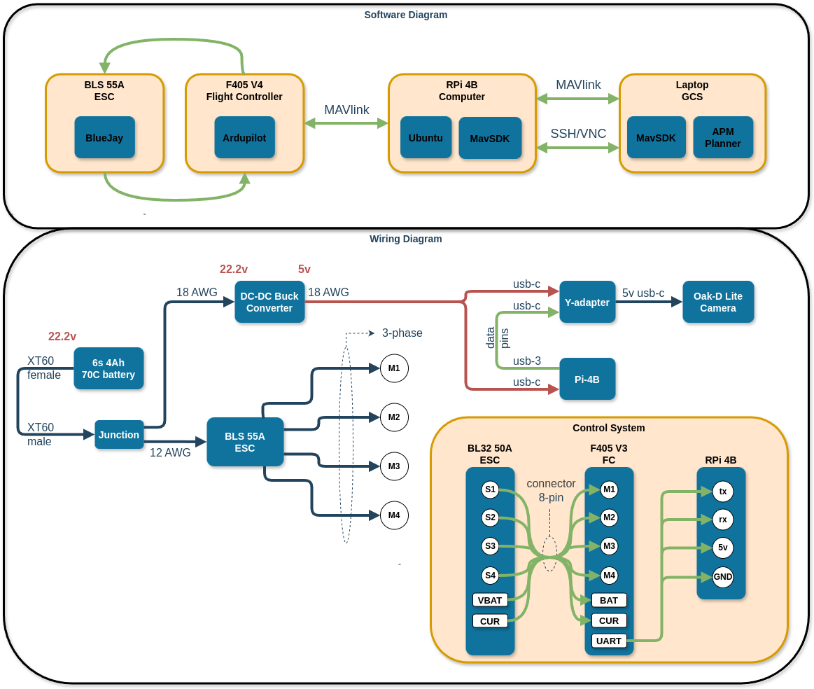

# Specifications
* Cost: €750
* Mass: 1.25 kg
* Upwards Acceleration: 4.4 g
* Size (motor-to-motor): ~250 mm
* [Specs-Calculator-Online](https://ecalc.ch/xcoptercalc.php)

|  |  |  |  |
| ------------- | ------------- | ------------- |------------ | 
|   |   |  |  |

|  |  |  |  |
| ------------- | ------------- | ------------- |------------ | 
|   |   |  |  |

|  |  | 
| ------------- | ------------ | 
|   |   |

# Project Overview
1. 3D print the drone frame
2. Install the electrical [sub-systems](https://github.com/MichaelThamm/drone-project/tree/main/sub-systems)
3. Configure the Ardupilot parameters using Mission Planner
4. Write, implement, and test the [Python Dronekit](https://github.com/MichaelThamm/autonomous-drone/tree/main/sub-systems/control-system/python-code) flight routines.
5. Implement [computer-vision](https://github.com/MichaelThamm/drone-project/tree/main/sub-systems/vision).
6. Create spatial-awareness and autonomous flight.

# Purchase Links
* _Prices are tax included_
* €34.90 - [2500KV 3-6S Brushless Motor](https://www.banggood.com/4X-Racerstar-2207-BR2207S-Fire-Edition-2500KV-3-6S-Brushless-Motor-For-RC-Drone-FPV-Racing-Frame-Kit-p-1284981.html?utm_source=googleshopping&utm_medium=cpc_organic&gmcCountry=AT&utm_content=minha&utm_campaign=aceng-pmax-at-en-pc&currency=EUR&cur_warehouse=CN&createTmp=1&utm_source=googleshopping&utm_medium=cpc_eu&utm_content=lynna&utm_campaign=aceng-pmax-at-en-top5ca1-220705&ad_id=&gclid=CjwKCAjwrranBhAEEiwAzbhNtclSIyOhJE-qOn81EOJPpisrpuhJdMc0ZsXfh0jFA0ho2sGsMIhjzhoCMK4QAvD_BwE)
* €168.26 - [cuav-v5-nano-flight-controller](https://store.cuav.net/shop/v5-nano/)
* €47.51 - [speedybee-f7-v3-BL32-50A-4-in-1-esc](https://www.speedybee.com/speedybee-f7-v3-bl32-50a-4-in-1-esc/#Manual)
  * I chose to buy the €55.89 - [speedybee-f405-v3-bls-50a-30x30-fc-esc-stack](https://www.speedybee.com/speedybee-f405-v3-bls-50a-30x30-fc-esc-stack/) instead since the whole stack was €10 more but gives you an FC.
* €16.90 - [BetaFPV-ELRS-lite-receiver](https://www.drone-fpv-racer.com/en/elrs-lite-receiver-by-betafpv-9218.html#/10019-antenna-tower_antenna)
* €55.57 - [remote-control](https://betafpv.com/products/literadio-3-radio-transmitter)
* €92.4 - [4Ah-70C-6S-battery](https://www.snhobbies.com/product_info.php?cPath=903_43_909&products_id=14901)
* €52.79 - [battery-charger](https://www.amazon.ca/gp/product/B0B5LLVSRK/ref=ox_sc_act_title_2?smid=A2M5Y5AVP4X7RH&psc=1)
* €7.99 - [buck-converter-5V-6A](https://universal-solder.ca/product/dc-dc-converter-5v-6a-output-9-36v-input-usb-port/)
* €67.00 - [raspberry-pi-4b](https://www.amazon.de/-/en/Raspberry-ARM-Cortex-A72-WLAN-ac-Bluetooth-Micro-HDMI-Single/dp/B07TC2BK1X/ref=sr_1_4?keywords=raspberry%2Bpi&qid=1691395648&sr=8-4&th=1)
* €138.85 - [oak-d-lite-camera](https://shop.luxonis.com/products/oak-d-lite-1)
* €17.71 - [oak-d-y-adapter](https://shop.luxonis.com/collections/accessories/products/oak-y-adapter)
* €50.00 - cables and connectors